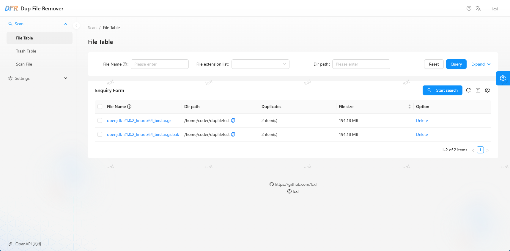

# Dup File Remover

[中文说明](./README_CN.md)

**Note: The software is currently in testing phase. Please maintain a backup habit for important files, as we are not responsible for any file loss caused by using this software.**

`Dup File Remover` is a software designed to find and delete duplicate files. It is deployed using Docker and is specifically adapted for scenarios such as NAS. The software employs a front-end and back-end separation technology stack, with the back-end written in Rust and the front-end utilizing the Ant Design Pro solution.



## Installation

### Docker Deployment

Docker deployment is very simple; you just need to pull the image and run the container. The command to run is as follows:
```bash
docker run -d --name dup-file-remover \
    -p 8081:8081 \
    -v /host/path/to/conf:/app/conf \
    -v /host/path/to/data:/app/data \
    lcxl/dup-file-remover:latest
```
Docker Compose deployment method:
```yaml
version: '3'
services:
  dfr:
    container_name: dfr
    image: lcxl/dup-file-remover:latest
    ports:
      - "8081:8081"
    restart: unless-stopped
    volumes:
      - /host/path/to/conf:/app/data
      - /host/path/to/data:/app/conf
```
Here, `/app/conf` and `/app/data` are the directories for storing configuration files and data, respectively. The `/app/data` directory should point to where duplicate files will be removed and must have read/write permissions; otherwise, there may be issues with program execution.

## Building from Source

If you want to build from source code, you can follow these steps:
* Clone this code repository locally;
* Install Docker for image building. For Docker installation, refer to the [Docker official documentation](https://docs.docker.com/engine/install/)
* Execute the `build_docker.sh` command to build the image; the default generated image name will be `lcxl/dup-file-remover:latest`
* Run the image using the `docker run` command, referencing the above configuration file.

## User Manual

See：[User Manual](./docs/USAGE_EN.md)


## Application Development

If you want to develop, you can follow these steps:
* Clone this code repository locally;
* Install the necessary software:
    * Rust: for compiling the backend application; refer to [Rust official documentation](https://www.rust-lang.org/learn/get-started)
    * NPM: for compiling the Web frontend application; refer to [NPM official documentation](https://docs.npmjs.com/downloading-and-installing-node-js-and-npm)
* Execute `cargo run` in the code repository root directory to run the backend application;
* Switch to the `web` directory, execute `npm run start` to run the frontend application;
* Open a browser and access `http://localhost:8000` to view the application.
The front-end and back-end of the application communicate using the OpenAPI protocol. When there is a change in the backend HTTP interface, run the following command during runtime in the backend: `./update_web_openapi.sh` to update the OpenAPI interface of the frontend application.
