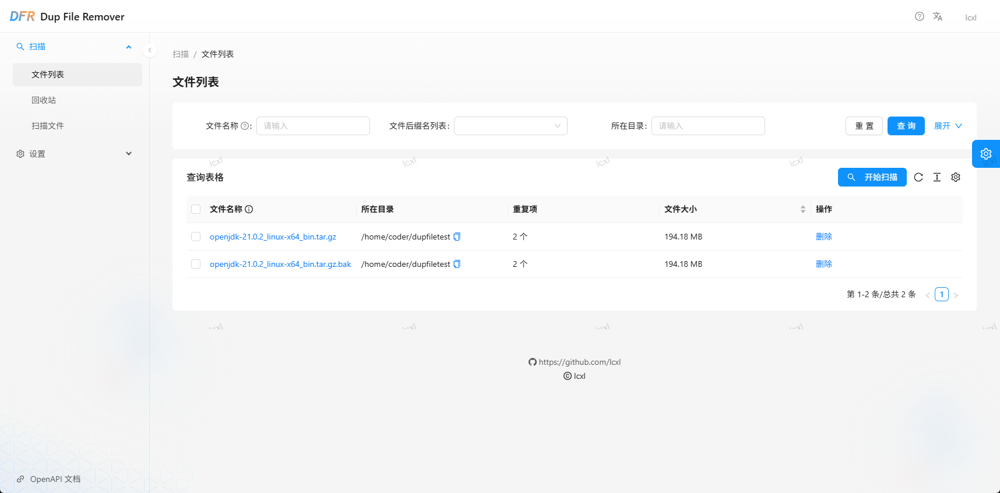

# Dup File Remover

[English Readme](./README.md)

**注意：此软件目前处于测试阶段，请对重要文件保持备份的习惯，任何使用此软件所造成的文件丢失将不负责任。**

`Dup File Remover` 是一款查找和删除重复文件的软件，使用 docker 进行部署，专门适配了 NAS 等场景。使用前后端分离的技术方案，后端使用 rust 编写，前端使用 ant design pro 解决方案。



## 安装

### Docker 部署

docker 部署非常简单，只需要拉取镜像并运行容器即可。运行命令如下：
```bash
docker run -d --name dup-file-remover \
    -p 8081:8081 \
    -v /host/path/to/conf:/app/conf \
    -v /host/path/to/data:/app/data \
    lcxl/dup-file-remover:latest
```

docker compose 部署方式：
```yaml
version: '3'
services:
  dfr:
    container_name: dfr
    image: lcxl/dup-file-remover:latest
    ports:
      - "8081:8081"
    restart: unless-stopped
    volumes:
      - /host/path/to/conf:/app/conf
      - /host/path/to/data:/app/data
```

这里 `/app/conf` 和 `/app/data` 是配置文件和数据的存储目录，`/app/data` 要指向到删除重复文件的目录，并且需要有读写权限，否则程序运行可能会有问题。

## 从源码构建

如果你想从源代码开始进行构建，可以按照以下方式：

* 克隆此代码仓库到本地；
* 安装 docker，用于构建镜像，docker 安装参考 [docker 官方文档](https://docs.docker.com/engine/install/)
* 执行 `sudo ./build_docker.sh` 命令构建镜像，生成的镜像名称默认为 `lcxl/dup-file-remover:latest`
* 使用 `docker run` 命令运行镜像，参考上面的配置文件。

## 使用手册

参见：[使用手册](./docs/USAGE_CN.md)

## 应用开发

如果你想进行开发，可以按照以下方式：
* 克隆此代码仓库到本地；
* 安装必须的软件：
    * Rust：用于编译后端应用，参考 [Rust 官方文档](https://www.rust-lang.org/learn/get-started)
    * NPM: 用于编译Web前端应用，参考 [NPM 官方文档](https://docs.npmjs.com/downloading-and-installing-node-js-and-npm)
* 在代码仓库根目录中执行 `cargo run` 运行后端应用；
* 切到 `web` 目录，执行 `npm run start` 运行前端应用；
* 打开游览器，访问 `http://localhost:8000` 查看应用。

应用前端和后端使用openapi协议进行通信。当后端 HTTP 接口有变更时，在后端运行期间执行以下命令 `./update_web_openapi.sh` 对前端应用的 openapi 接口进行更新操作。