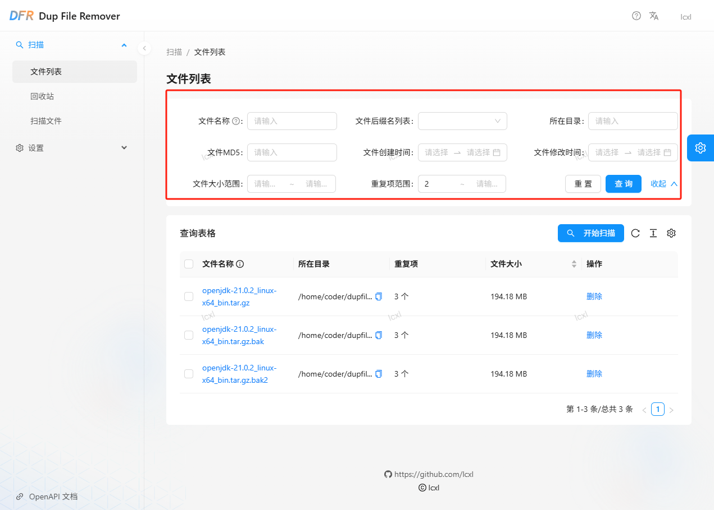
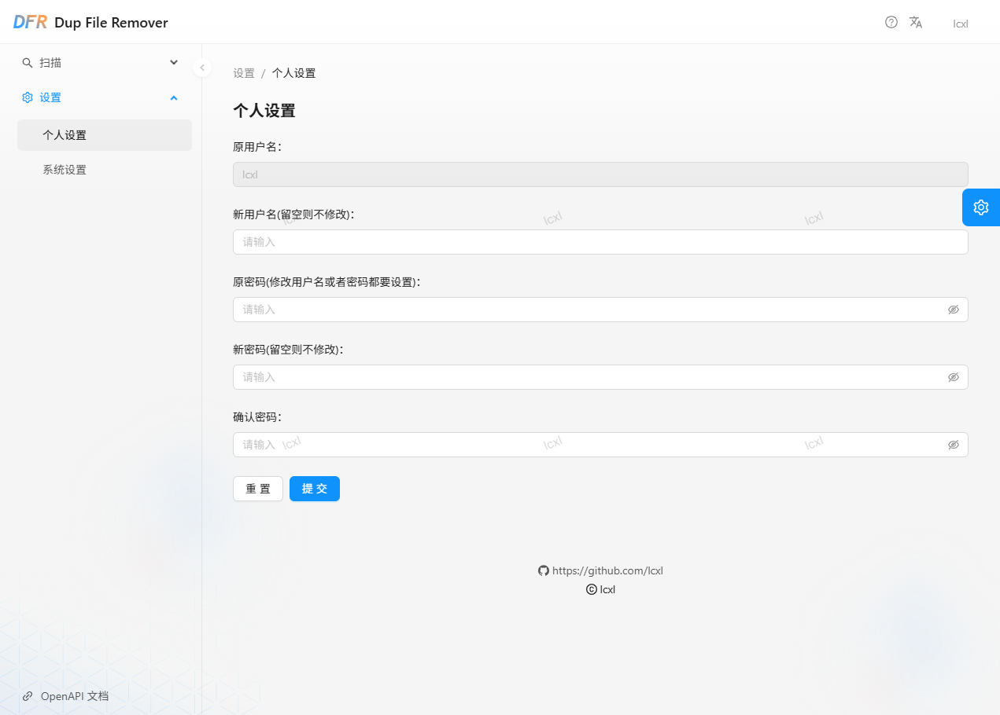

## 使用手册

### 登录

使用游览器访问 dup-file-remover 容器对应的 ip 地址，例如 `http://<ip/hostname>:8081` ，如果访问地址正确，则会显示如下页面：

在登录界面中输入用户名和密码进行登录。如果是第一次登录，为了安全应用会随机生成密码，请进到容器内查看 `/app/conf/config.toml` 中的 `user` 和 `password` 配置项的值。并且请务必修改默认密码以确保安全。

### 重复文件扫描

登录之后默认进到文件列表页面，第一次使用时文件列表为空，需要进行文件扫描操作，请点击“开始扫描”进到扫描页面：

在扫描页面中选择要扫描的目录、要扫描的文件后缀、文件大小以及要排除的目录，然后点击“开始扫描”，应用就会在后台开始扫描文件，扫描完成之后可以返回到文件列表页面中查看扫描结果。

### 文件管理

在文件列表页面中，可以设置不同的查询条件来查看对应的文件搜索结果。例如，可以通过输入文件名、文件大小、文件类型、重复项数量等进行搜索：

如果你需要删除一个重复的文件，点击右侧的“删除”按钮进行删除：

> 注意：默认情况下无法删除不重复的文件

文件删除之后会放到回收站中。

> 注意：批量删除操作目前暂不支持，后续会支持批量删除功能。

### 回收站管理

在回收站页面中，可以查看被删除的文件列表。你可以通过点击“恢复”按钮将文件恢复到原来的位置，或者点击“删除”按钮永久删除这些文件：

回收站对于超过30天（默认值，可在系统参数中进行修改设置）未被访问的文件进行自动清理，以节省磁盘空间。

> 注意：批量删除和恢复操作目前暂不支持，后续会支持批量删除和恢复功能。

### 个人设置

点击“设置”->“个人设置”进入到个人设置页面，在个人设置页面中可以设置登录此应用的用户名和密码：

### 系统设置

点击“设置”->“系统设置”进入到系统设置页面，在系统设置页面中可以设置此应用相关的系统参数，例如监听地址、http端口号、回收站清理时间等参数：

