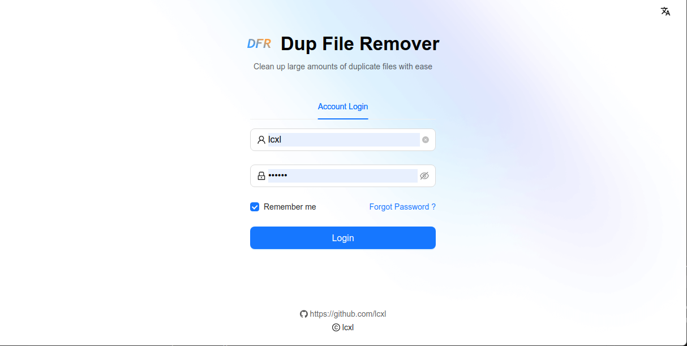
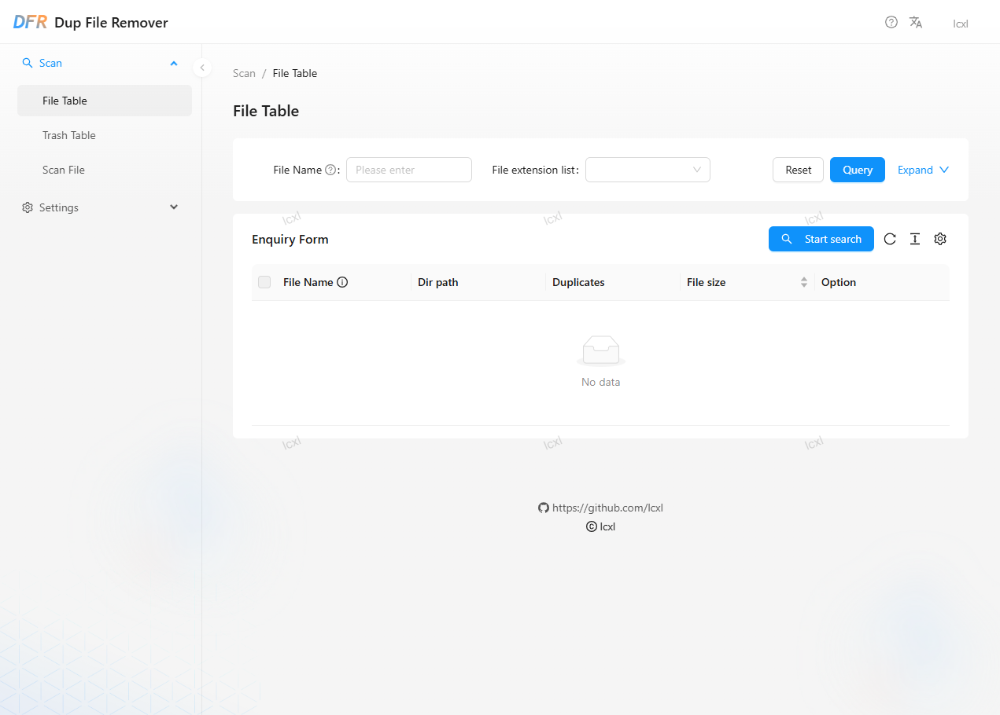
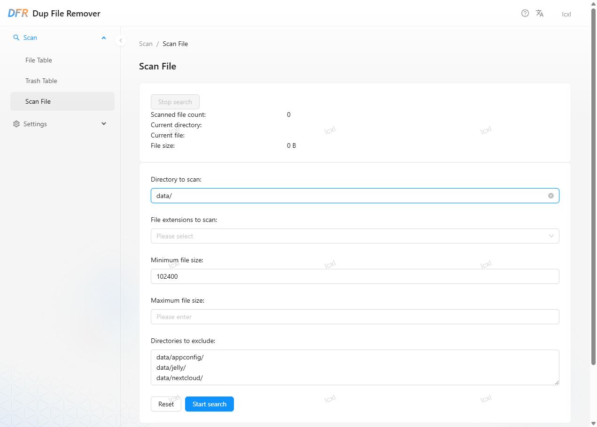
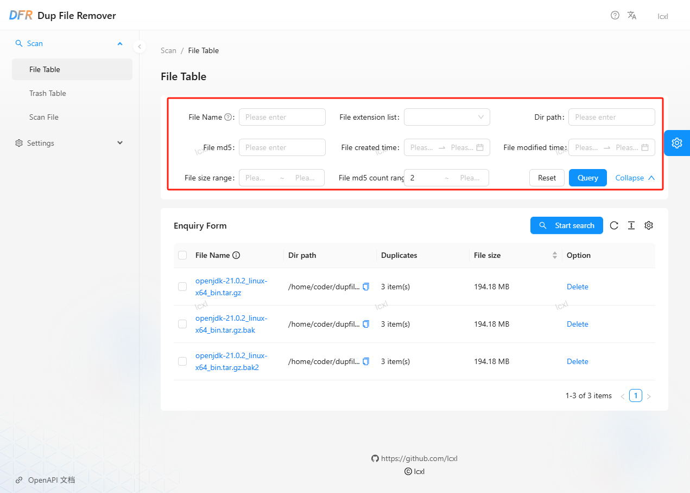
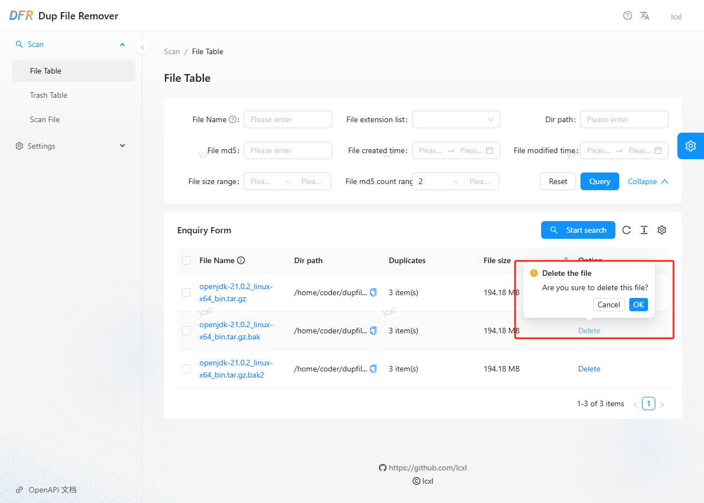
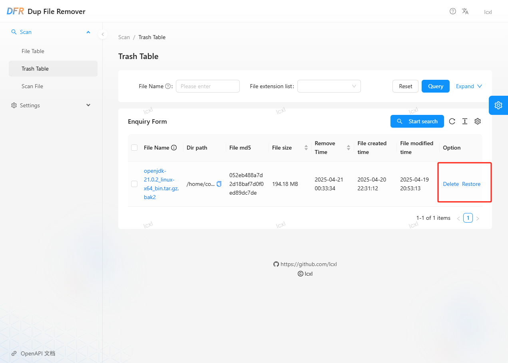
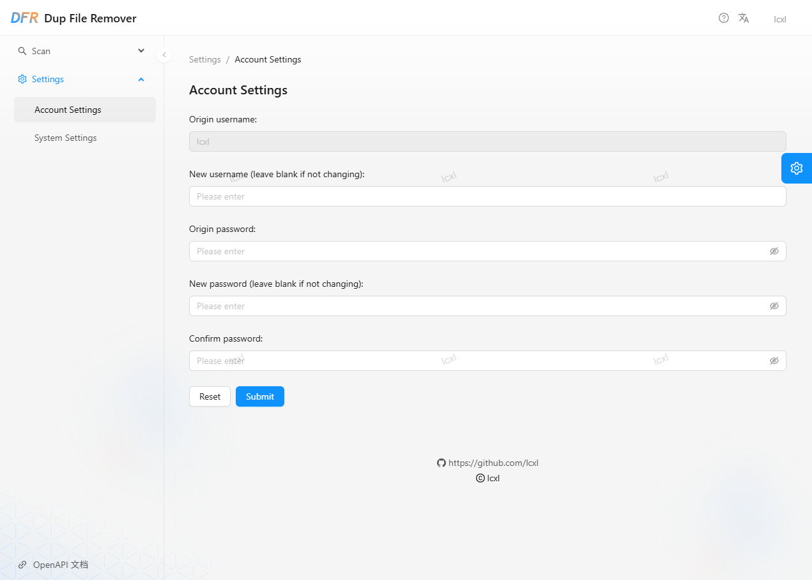
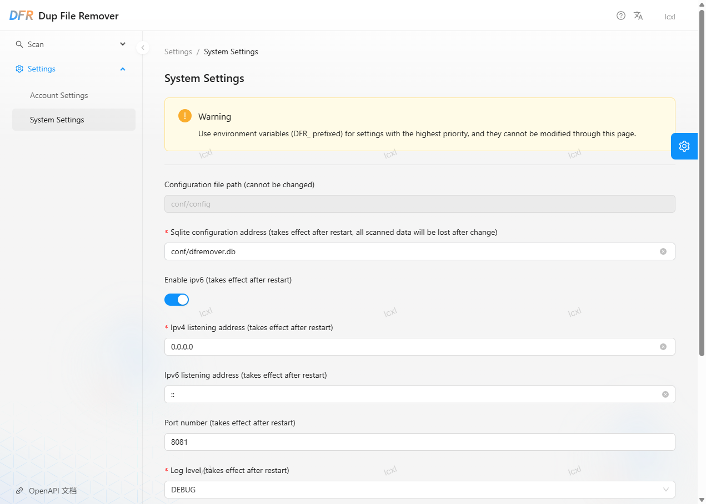

## User Manual

### Login

Access the IP address of the dup-file-remover container using a browser, for example `http://<ip/hostname>:8081`. If the access address is correct, you will see the following page:

Enter your username and password to log in. If this is your first login, for security reasons, the application will randomly generate a password. Please go into the container to view the `user` and `password` configuration items in `/app/conf/config.toml`. And please ensure that you modify the default password.

### Duplicate File Scan

After logging in, you will be directed to the file list page by default. On the first use, the file list will be empty, and a file scan operation is required. Please click "Start Scan" to go to the scanning page:

On the scanning page, select the directory to scan, the file extension to scan, the file size, and the directories to exclude. Then click "Start Scan", and the application will start scanning files in the background. After the scan is complete, you can return to the file list page to view the scan results.

### File Management

On the file list page, you can set different query conditions to view corresponding file search results. For example, you can search by entering the filename, file size, file type, number of duplicates, etc.

If you need to delete a duplicate file, click the "Delete" button on the right:

> Note: By default, non-duplicate files cannot be deleted.

After deleting a file, it will be moved to the trash.

> Note: Batch deletion operations are currently not supported; support for batch deletion functionality will be added in the future.

### Trash File Management

On the trash file page, you can view the list of deleted files. You can click the "Restore" button to restore files to their original location or click the "Delete" button to permanently delete these files:

The Recycle Bin automatically cleans up files that have not been accessed for more than 30 days (default value, can be modified in system parameters) to save disk space.

> Note: Batch deletion and recovery operations are currently not supported; support for batch deletion and recovery functionality will be added in the future.

### Account Settings

Click "Settings" -> "Account Settings" to enter the account settings page. On the account settings page, you can set the username and password for logging into this application:

### System Settings

Click "Settings" -> "System Settings" to enter the system settings page. On the system settings page, you can set system parameters related to this application, such as listening address, HTTP port number, Recycle Bin cleanup time, etc.

